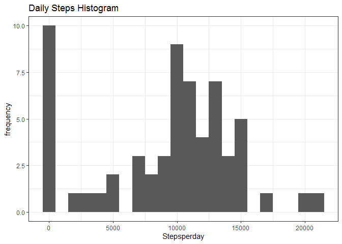
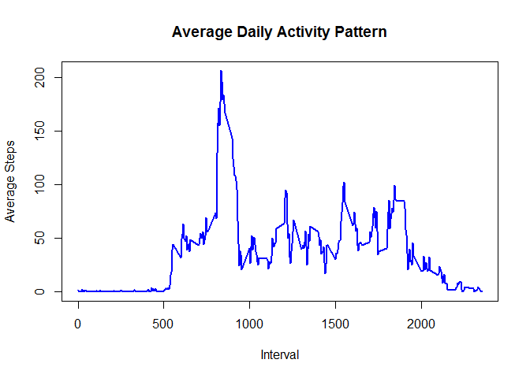
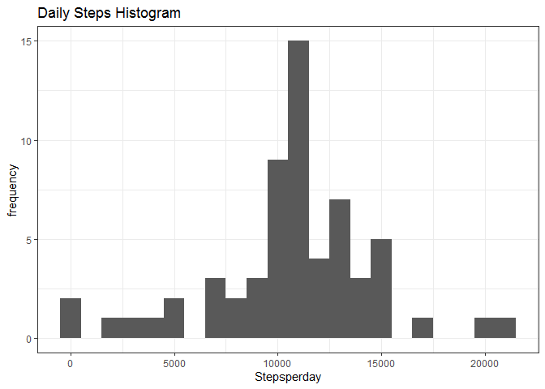
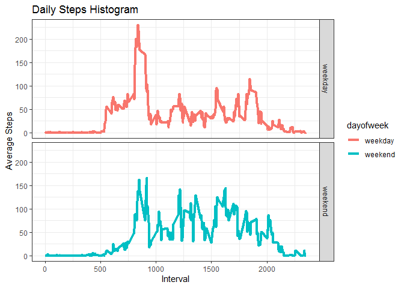

## Setup
### Load the libraries

```r
library(ggplot2)
library(dplyr)
```

## Loading and preprocessing the data


```r
activity <-read.table(unz("activity.zip","activity.csv"), sep=',',header = TRUE);
activity$date <- as.Date(activity$date)
activity$steps <- as.numeric(activity$steps)
```

## What is mean total number of steps taken per day?


```r
totalsteps <- activity %>% select (steps, date) %>% group_by(date) %>%    
    summarize(stepsperday=sum(steps, na.rm=T))

#histogram for total number of steps taken each day
ggplot(totalsteps, aes(x=stepsperday)) + 
geom_histogram(binwidth = 1000) + ggtitle("Daily Steps Histogram") +
labs (x = "Stepsperday", y = "frequency") + theme_bw() 
```

<!-- -->

```r
#mean steps per day
mean1 <- mean(totalsteps$stepsperday,na.rm=T)
mean1
```

```
## [1] 9354.23
```

```r
#median steps per day
median1 <- median(totalsteps$stepsperday,na.rm=T)
median1
```

```
## [1] 10395
```

## What is the average daily activity pattern?

### Average daily activity pattern 

```r
stepsbyinterval <- activity %>% select (steps, interval) %>% 
    group_by(interval) %>%    
    summarize(meansteps=mean(steps, na.rm=T)) 

#Time series plot of the 5-minute interval and the average number of steps taken, 
#averaged across all days 
plot(meansteps~interval, data = stepsbyinterval,type="l", xlab="Interval",
     ylab="Average Steps", main="Average Daily Activity Pattern",col="blue",lwd=2)
```

<!-- -->

### Interval with maximum steps on an average 

```r
val <- stepsbyinterval %>% filter(meansteps == max(meansteps)) %>% select(interval)
val$interval
```

```
## [1] 835
```

## Imputing missing values

### Number of missing values

```r
activity <-read.table(unz("activity.zip","activity.csv"), sep=',',header = TRUE)
lv <- activity[is.na(activity$steps) | is.na(activity$date) | is.na(activity$interval),]
nrow(lv)
```

```
## [1] 2304
```

### Strategy for imputing missing values 


```r
# we will use mean values for the interval over all days to fill in the the NA values
# Merge the main table and the stepsbyinterval tables on interval columns.
# If the steps is NA, replace with the mean value. It is ceiled to the next highest integer

activity <- merge(activity,stepsbyinterval,by.x="interval",by.y="interval",all=FALSE)
indx <- which(is.na(activity$steps), arr.ind = TRUE)    

activity[indx,]$steps <- ceiling(activity[indx,]$meansteps)
activity <- arrange(activity,date,interval)
activity <- activity %>% select(steps,date,interval) 
```

### Create a copy of the table after imputing missing values 

```r
data.table::fwrite(activity, "newActivity.csv", quote = FALSE)
```

### Histogram of the total number of steps taken each day with new table

```r
totalsteps <- activity %>% select (steps, date) %>% group_by(date) %>%    
    summarize(stepsperday=sum(steps, na.rm=T))

#histogram for total number of steps taken each day
ggplot(totalsteps, aes(x=stepsperday)) + 
geom_histogram(binwidth = 1000) + ggtitle("Daily Steps Histogram") +
labs (x = "Stepsperday", y = "frequency") + theme_bw() 
```

<!-- -->

```r
#mean steps per day
mean2 <- mean(totalsteps$stepsperday,na.rm=T)
mean2
```

```
## [1] 10784.92
```

```r
#median steps per day
median2 <- median(totalsteps$stepsperday,na.rm=T)
median2
```

```
## [1] 10909
```

### Impact of imputing missing data on the estimates of the total daily number of steps?
Test with Missing values    has mean : 9354  and median  1.0395\times 10^{4} 

Test without Missing values has mean : 1.0785\times 10^{4}  and median  1.0909\times 10^{4} 

Conclusion : Mean and Median values increase after substituting the missing values. 

## Are there differences in activity patterns between weekdays and weekends?

```r
#Create a new factor variable in the dataset with two levels – “weekday”
#and “weekend” indicating whether a given date is a weekday or weekend
#day
activity$date <- as.Date(activity$date)
activity$dayofweek <- factor(weekdays(activity$date, abbreviate=TRUE),
       levels=c("Mon","Tue","Wed","Thu","Fri","Sat","Sun"),
       labels=c("weekday","weekday","weekday","weekday","weekday","weekend","weekend"))

# Draw a panel plot containing a time series plot (i.e. type = "l") of the
# 5-minute interval (x-axis) and the average number of steps taken, averaged
# across all weekday days or weekend days (y-axis).
totalstepsbyday <- activity %>% select (steps, interval, dayofweek) %>% group_by(dayofweek,interval) %>% summarize(meansteps=mean(steps, na.rm=T))

ggplot(totalstepsbyday, aes(x=interval,y=meansteps,col=dayofweek)) + 
  facet_grid(dayofweek~.) + 
geom_line(lwd=1.5) + ggtitle("Daily Steps Histogram") +
labs (x = "Interval", y = "Average Steps") + theme_bw() 
```

<!-- -->
